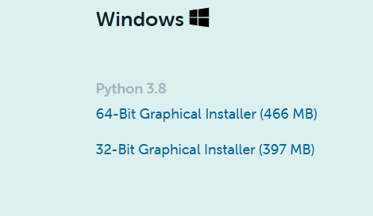
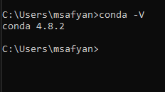
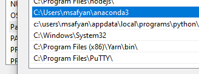
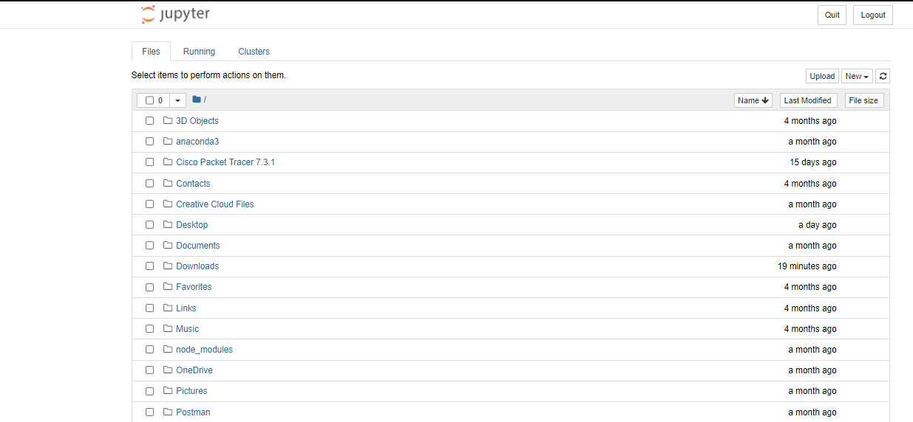
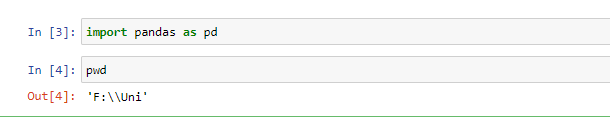
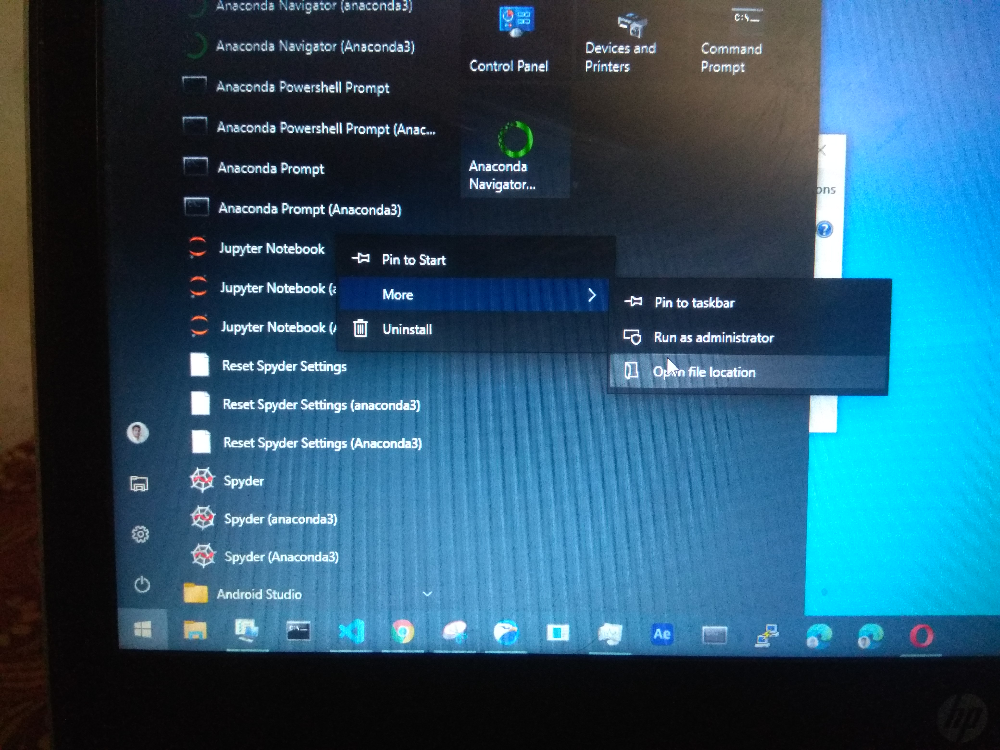
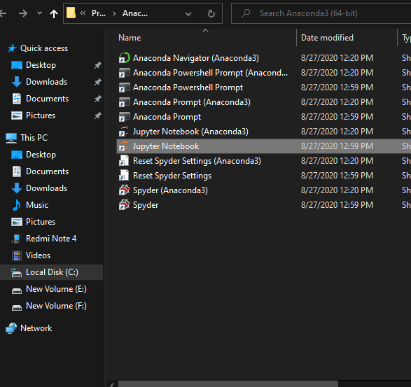
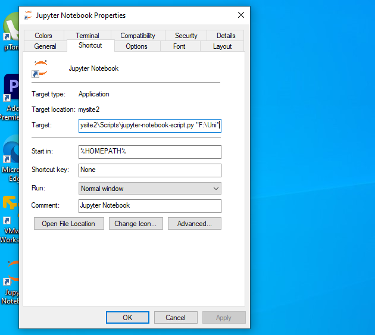
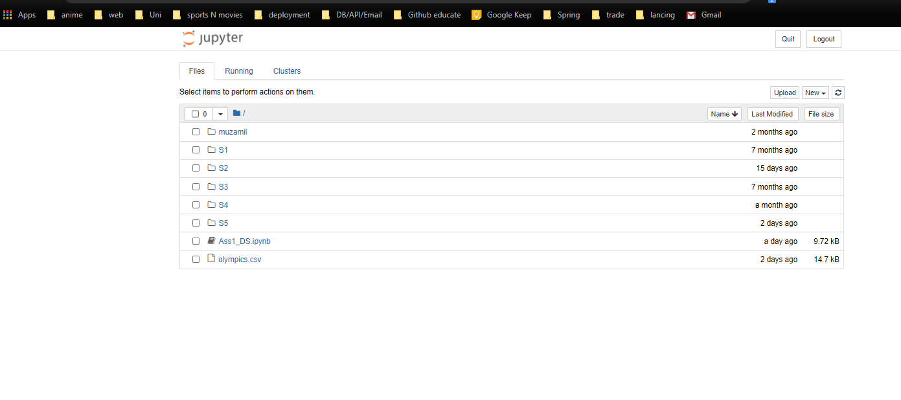

## Must watch

Watch this [video](https://www.youtube.com/watch?v=7eh4d6sabA0&feature=youtu.be) and you may not need to read further.

### Anaconda

1. Click [Anaconda](https://www.anaconda.com/products/individual) Downlaod link
1. scroll down to page bottom and you will see windows installer.
1. Most probably it will be 64-bit installer for your computer.
   
1. after installaiton is completed confirm via typing in command prompt.

```bash
conda -v
```



1.  if you see **conda 4.8**, no need for env variables.
1.  In case of you see **conda not found error**. you should add path to environemnt varialbes

    

### Jupyter Notebook

1. First we will change jupyter default directory
   [watch this video](https://www.youtube.com/watch?v=46HHSDdKilc&t=273s) for more information.
1. jupyter default directory will be _C:/users/yourName_
   

1. you can use **pwd** command you checking in which directory you are, if you don't know how to do this just skip this instruction, this is optional.
   

1. Type Jupyter notebook in windows search bar
1. Open file location

   

1. Right click on _jupter notebook_ copy and paste this on destop OR create Shortcut on destop screen. [watch this video](https://www.youtube.com/watch?v=46HHSDdKilc&t=273s) for more information.
1. 
1. Right click and open properties and click shortcut.
1. In target at the end of file change %USERPROFILE to the path you want to use for your projects in my case it is **"F:/Uni/"**
1. dont Forget "
1. click _OK_
   

1. now double click on the shortcut jupyter notebook shortcut whose path you changed.

   

1. You will see that your default working directory is changed.

### Jupyter and pandas

1. Now copy the _csv_ file in this folder.
1. Click on _new_ button at right hand side, it will create new project.
   
1. Jupyter has input and output fields

### important tip

Whenever you press **tab key** in quotes for write path, jupyter will provide you a drop down of available files in this directory.

1. In our case as we are downloading csv from google classroom it will be converted to excel.
1. you should use **read_excel** function.
   

### Note.

- you should check the video link in case of jupyter shortcut and directory change.
- Anaconda not installed, add path varibles
- pandas.read_excel('') directory/file not found use **tab** key in quotes and jupyter will show you available fils.
